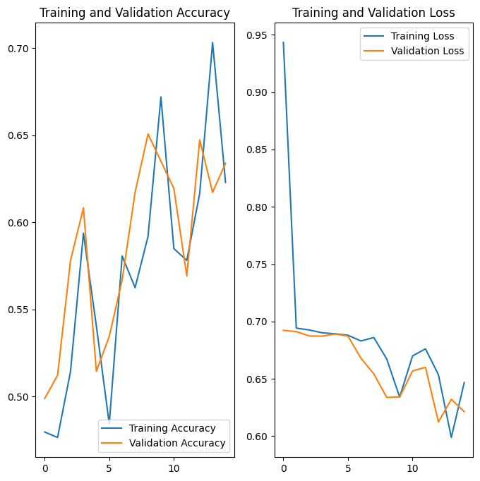

# 🐱🐶 Cat and Dog Image Classifier

A deep learning project that classifies images of **cats and dogs** using a **Convolutional Neural Network (CNN)** built with **TensorFlow** and **Keras**. This project was part of the **freeCodeCamp TensorFlow Certification**.


## 📌 Project Summary

This image classification model learns to distinguish between cats and dogs using labeled image data. The solution includes **data preprocessing**, **data augmentation**, and a **sequential CNN architecture** to achieve high accuracy on both validation and test sets.


## 🧠 Key Concepts

- **Convolutional Neural Networks (CNN)**
- **Binary classification**
- **Data augmentation**
- **Model evaluation** with accuracy and loss metrics
- **Image prediction and visualization**

## 🧪 Dataset

- **Downloaded from**: [freeCodeCamp CDN]([https://cdn.freecodecamp.org](https://cdn.freecodecamp.org/project-data/cats-and-dogs/cats_and_dogs.zip))
- **Data Split**:
  - Training set
  - Validation set
  - Test set
- **Balanced Dataset**: Contains an equal number of **cat** and **dog** images to ensure unbiased training.

## ⚙️ Model Architecture

A **Sequential CNN** with the following layers:

```python
Conv2D(32) → MaxPooling2D →
Conv2D(64) → MaxPooling2D →
Conv2D(128) → MaxPooling2D →
Flatten →
Dense(512) →
Dense(1, activation='sigmoid')
```

- **Activation Functions**:  
  - `ReLU` for intermediate layers  
  - `Sigmoid` for the binary output layer
- **Loss Function**: `Binary Crossentropy`
- **Optimizer**: `Adam`


## 🧹 Preprocessing and Augmentation

- All images were resized to **150x150 pixels**
- Pixel values rescaled to the **[0, 1] range**
- **Data Augmentation Techniques**:
  - Rotation
  - Width & height shifts
  - Shear transformation
  - Zooming
  - Horizontal flips


## 📈 Training & Evaluation

- **Epochs**: 15  
- **Batch Size**: 128  
- **Metrics Tracked**:  
  - Accuracy (Training & Validation)  
  - Loss (Training & Validation)

Final training and validation curves:

## 🧪 Testing & Results

- Evaluated on a set of **50 unseen images**
- Predictions classified using a **0.5 sigmoid threshold**
- **Achieved**: ~66% accuracy  

- **Challenge Pass Threshold**: 63%  
✅ **Challenge Passed**


> 🎯 This project demonstrates the use of deep learning for image classification, combining CNNs with data augmentation to build a robust and accurate binary classifier.


## 📬 Let's Connect

I'm always open to feedback, collaboration, or career opportunities!

🔗 [LinkedIn](https://www.linkedin.com/in/mmbillah804/)  
🔗 [GitHub](https://github.com/mmbillah804)
